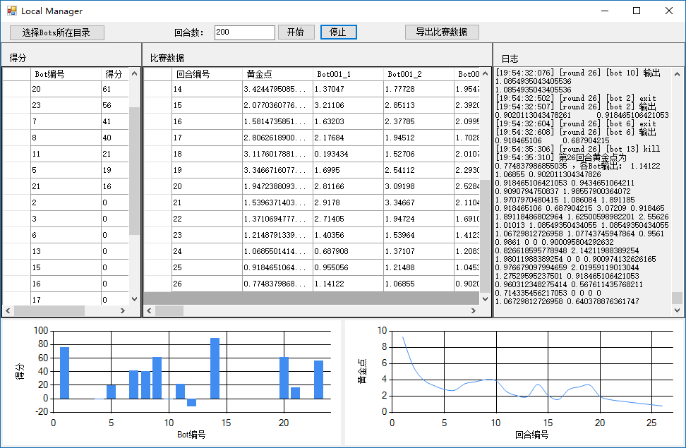

# 离线黄金点游戏 -- 机器人比赛环境

## 简介

LocalManager提供了离线黄金点游戏的机器人比赛环境。

借助该环境，管理员可以调度执行玩家提交的机器人程序，并给机器人程序提供历史数据作为输入，在机器程序运行结束时读取输出的预测值，最后在每回合结束时计算黄金点及玩家的得分。该环境支持设定比赛回合数以及显示实时比赛结果。



## 准备

* 管理员收集所有玩家的机器人程序，每个玩家的机器人程序为一个文件夹，如`001`、`002`，然后所有玩家再放在同一文件夹中，如`bots`。示例如下：

    ```
    \---bots
        +---001
        |   |   bot.exe
        |           
        +---002
        |   |   bot.exe
        |   |   depends files ...
        |           
        +---003
        |   |   get_numbers.py
        |           
        +---004
        |   |   get_numbers.py
        |   |   other files ...
    ```

    > Tips: 如果玩家的机器人最终产出是exe可执行程序，那么对应的目录下应包括该exe运行时所依赖的所有文件，保证该exe在干净环境中也可以运行。如果玩家的机器人是python脚本，请务必命名为get_numbers.py

* 运行比赛环境的机器上需要安装python，并配置对应的环境变量。还需要和玩家统一python版本号，如果玩家需要用到numpy或其它库，也需要提前配置好。

## 步骤

1. 编译运行LocalManager程序，即比赛环境。

2. 点击选择Bots所在目录，选择前面准备工作中收集的机器人的目录。

    > 日志窗口中应显示出发现了哪些Bot及其编号

3. 设定要运行的回合数，如400

4. 点击开始

    > 比赛过程中会实时显示比赛数据，可以看到每一回合的黄金点及走势，也可以看到玩家的得分情况

5. 比赛结束后，点击导出比赛数据，可以导出历史数据、玩家得分、日志